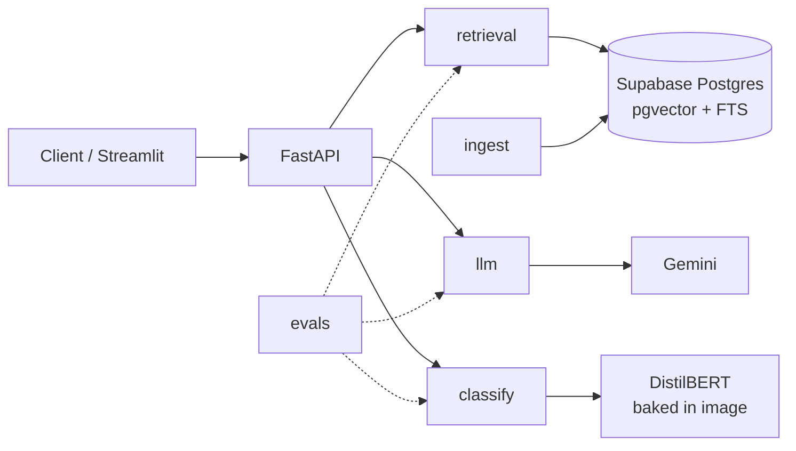

# ADR 0001: Modular monolith on FastAPI, hand-rolled RAG core

- Status: Accepted
- Date: 2026-10-02

## Context
Solo developer, 14 days, free-tier infra. Need three AI capabilities (classify, extract, ask) that are each evaluated, CI-gated, deployed, and observable. The project must demonstrate understanding of retrieval and evaluation internals.

## Decision
1. **One deployable service** (FastAPI) with internal modules: `ingest`, `retrieval`, `llm`, `classify`, `evals`, `api`. `api` is a thin layer; domain modules never import it.
2. **No LangChain/LlamaIndex** for the core path. Chunking, hybrid search (RRF), and reranking are written directly on Postgres/pgvector + HF models; LLM calls use the provider SDK directly.
3. **Postgres (Supabase) for both vector and full-text search**, so hybrid retrieval is one DB, not two systems to sync.
4. **Settings from env only** (12-factor) via pydantic-settings.
5. **Cloud Run** for serving (scale-to-zero, container-native), not Kubernetes.

## Consequences
+ Simple deploy, one image, one CI pipeline; full control and visibility over retrieval quality.
+ Every retrieval knob is testable and measurable by the eval harness.
− More code to own vs a framework; modules must stay decoupled to split later if needed.
− Single DB is a scale ceiling (fine at CUAD's ~500 docs).

## Alternatives considered
- Microservices (separate classifier service): rejected, operational overhead with no benefit at this scale.
- Dedicated vector DB (Qdrant/Pinecone): rejected, adds a second store and sync logic for hybrid search.
- Kubernetes: rejected, Cloud Run gives autoscaling and HTTPS without cluster management.
